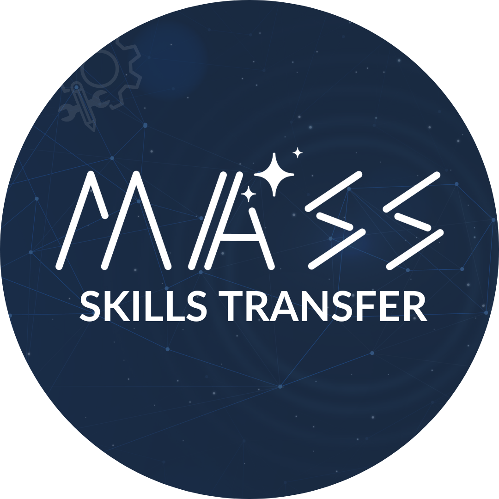

  

# MASS Skills Transfer
MASS Skills Transfer is a sharing and practical tutorial session that has been designed to help student members of the Malagasy Astronomical Soicety (MASS) on their research journey by providing them with research tips and skills that are perceived as trivial but are crucial to contributing effectively to their research projects.

This repository contains the materials and resources used in the sessions, including slides, code examples, and any additional resources shared during the sessions.

## Previous Sessions
* [Linux & Shell Script](Linux-Shell-Script/)
* [Plotting with Python](Plotting-With-Python/)
* [LaTeX and Overleaf](LaTeX-Overleaf/)

